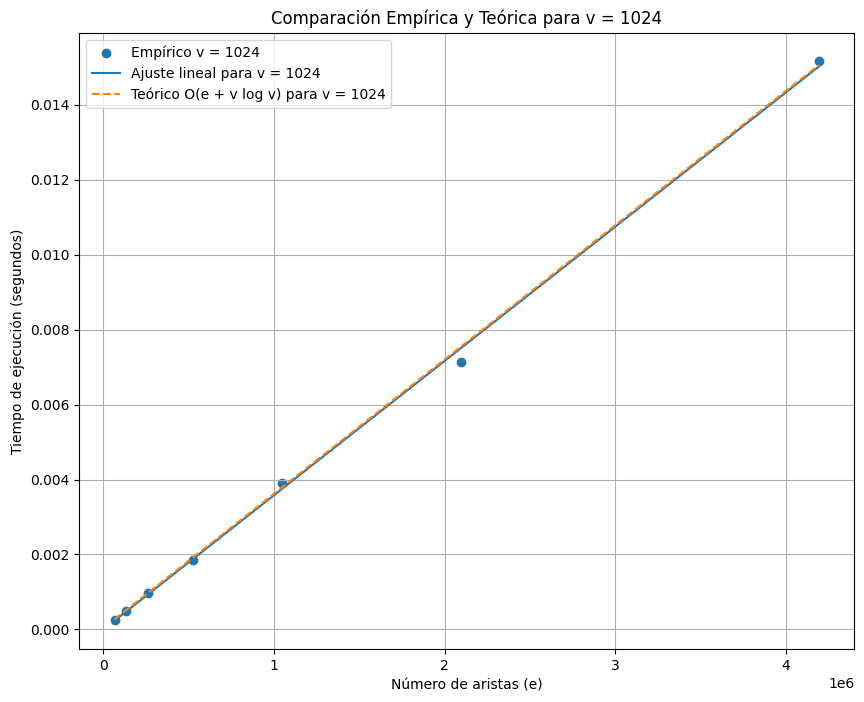
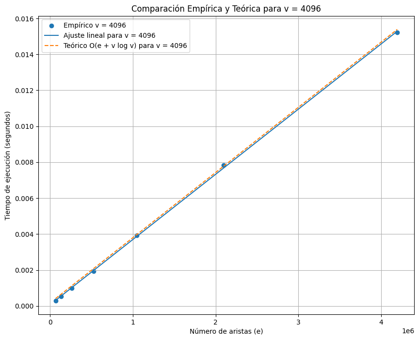
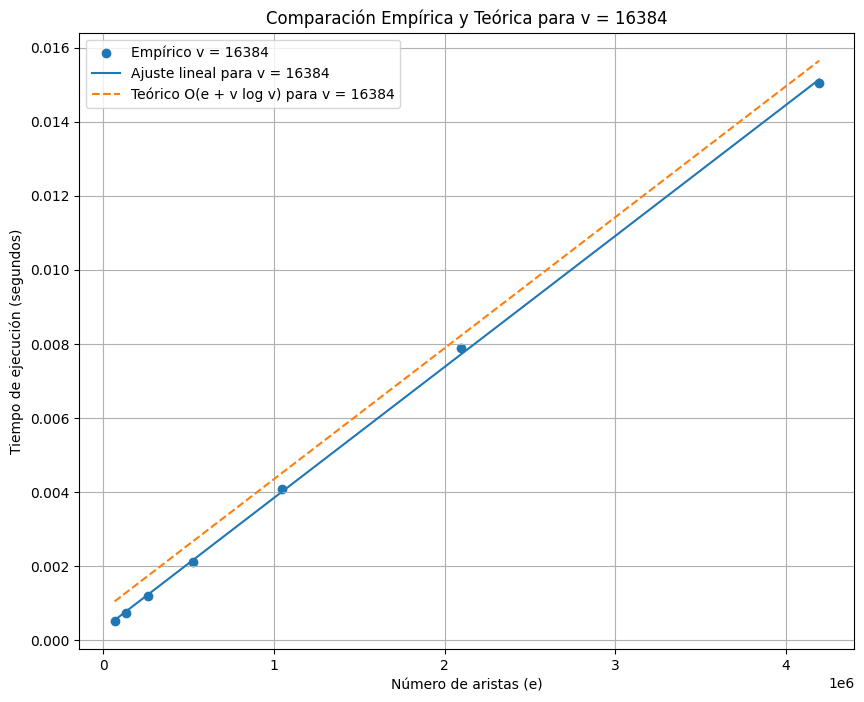

# tarea_2_logaritmos
# Algoritmo de Dijkstra con Colas de Fibonacci

Este proyecto implementa y evalúa experimentalmente el algoritmo de Dijkstra utilizando colas de Fibonacci para encontrar el camino más corto en un grafo no dirigido y con pesos positivos. El objetivo principal es comparar el rendimiento empírico del algoritmo con su complejidad teórica.

## Estructura del Proyecto

El repositorio contiene los siguientes archivos:

- `FibonacciHeap.h` y `FibonacciHeap.cpp`: Implementación de la cola de Fibonacci.
- `main.cpp`: implementa el algoritmo de dijkstra utilizando min heap.
- `d_heap.cpp`: Implementación de un heap.
- `structures.h` y `structures.cpp`: Implementación de la estructura de grafo y utilidades relacionadas.
- `structuresfib.h` y `structuresfib.cpp`: Implementación de la estructura de grafo y utilidades relacionadas para FibonacciHeap.
- `d_fibonacci.cpp`: Implementación del algoritmo de Dijkstra utilizando colas de Fibonacci y generación de grafos.
- `execution_times.csv`: Archivo CSV con los tiempos de ejecución de las pruebas realizadas.
- `Makefile`: un makefile para compilar los archivos

## Archivos y Descripción

### FibonacciHeap.h

Este archivo contiene la definición de la estructura de nodos y la clase `FibonacciHeap` que implementa las siguientes operaciones:

- `MAKE_HEAP()`: Crea y retorna una nueva cola de Fibonacci vacía.
- `INSERT(x)`: Inserta el elemento `x` en la cola de Fibonacci.
- `MINIMUM()`: Retorna el elemento con la clave mínima.
- `EXTRACT_MIN()`: Elimina y retorna el elemento con la clave mínima.
- `UNION(H2)`: Fusiona la cola actual con la cola `H2`.
- `DECREASE_KEY(x, k)`: Decrece la clave del elemento `x` a `k`.
- `DELETE(x)`: Elimina el elemento `x` de la cola de Fibonacci.

### FibonacciHeap.cpp

Este archivo contiene la implementación de los métodos definidos en `FibonacciHeap.h`.

### structures.h

Este archivo define las estructuras necesarias para representar grafos y aristas:

- `Edge`: Representa una arista del grafo con un peso y dos nodos.
- `Graph`: Representa un grafo con nodos y aristas. Proporciona métodos para generar un grafo conexo y agregar aristas.

### structures.cpp

Este archivo contiene la implementación de los métodos definidos en `structures.h`.

### d_fibonacci.cpp

Este archivo implementa el algoritmo de Dijkstra utilizando colas de Fibonacci. También contiene la lógica para generar grafos aleatorios y medir los tiempos de ejecución.

### execution_times.csv

Este archivo contiene los resultados de las pruebas realizadas, con los tiempos de ejecución registrados para diferentes tamaños de grafos y números de aristas.

## Compilación y Ejecución

### Requisitos

- Compilador de C++ (e.g., g++)
- Biblioteca estándar de C++

### Compilación y Ejecución

Para ejecutar el programa, usa el siguiente comando:

```sh
makefib
```
El programa generará grafos aleatorios, ejecutará el algoritmo de Dijkstra utilizando colas de Fibonacci, y registrará los tiempos de ejecución.

```sh
makeheap
```

El programa generará grafos aleatorios, ejecutará el algoritmo de Dijkstra utilizando minheap, y registrará los tiempos de ejecución.

### Análisis de Resultados

El archivo `execution_times.csv` contiene los resultados de las pruebas. Para analizar estos datos y compararlos con la complejidad teórica, puedes utilizar el script de Python implementado en pAnalisisFibonacci.py

## Documentación del Hardware y Software

- **CPU**: Intel i7-12650H con 8 nucleos a 2688.008 MHz en VM VirtualBox 7.0.14
- **RAM**: 4096 MB
- **Sistema Operativo**: Debian GNU/Linux 12 (bookworm)
- **Compilador**: g++ (Debian 12.2.0-14) 12.2.0
- **Versión del estándar de C++**: C++11

## Resultados Obtenidos Fibonacci

### Comparación Empírica y Teórica para v = 1024


### Comparación Empírica y Teórica para v = 4096


### Comparación Empírica y Teórica para v = 16384

